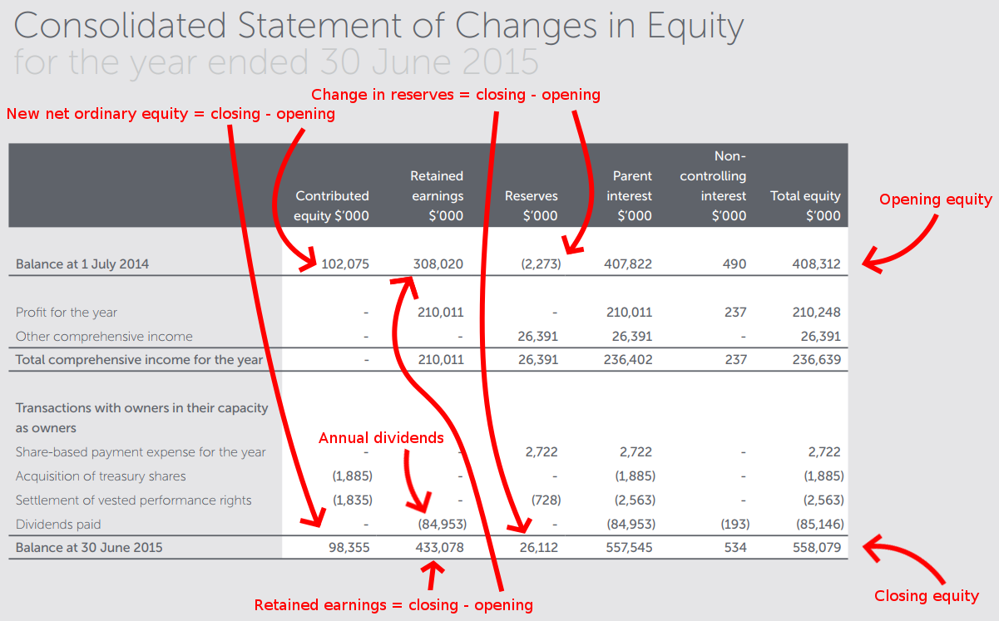
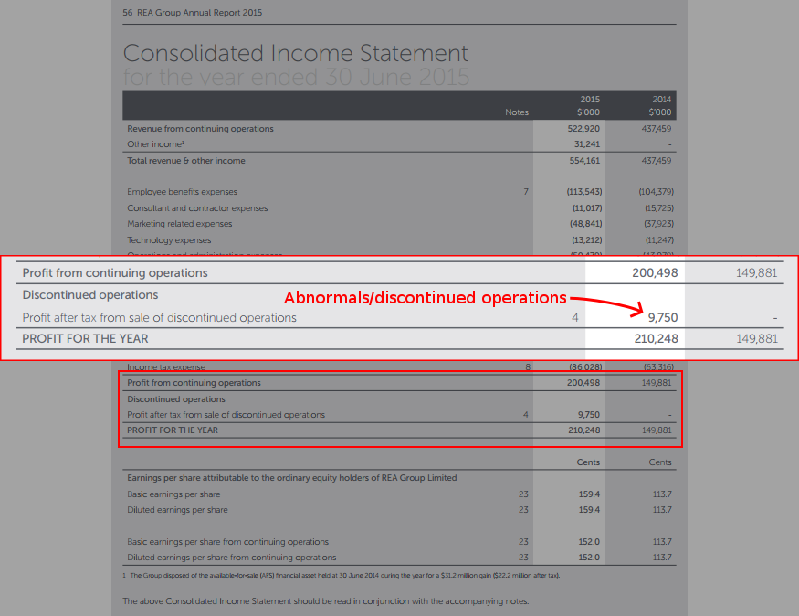
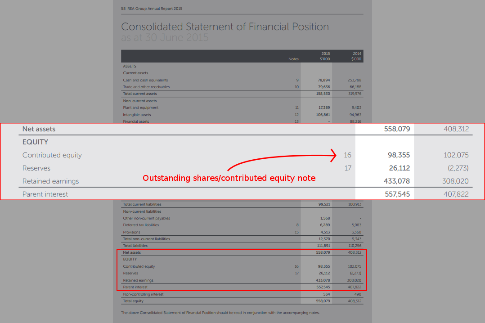
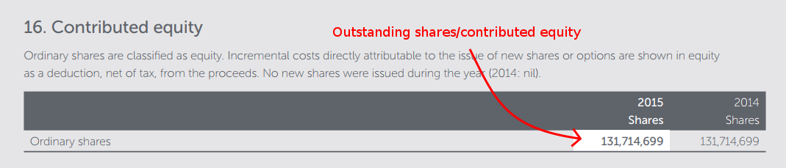
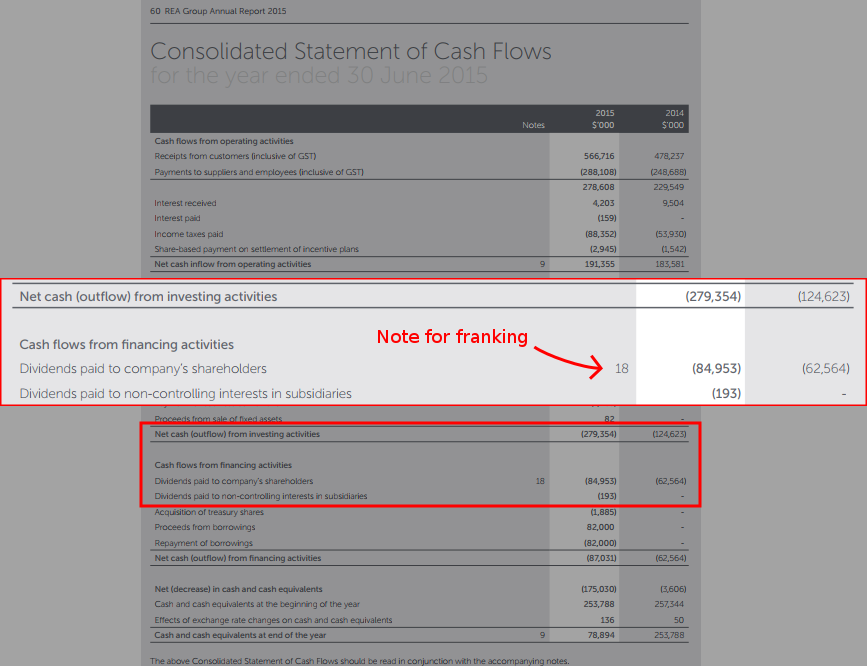
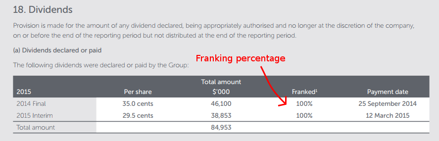

# How do I find the data?

All the data for the calculator can be found in the annual reports for your chosen stock. *gasp* finally a reason to read those huge reports.

This certainly isn't the only place to get the data but I've found I can get all the figures in one place here so it's easy to write a guide for it.

For this example, I'm using the REA [annual report for 2014/15 FY](https://www.rea-group.com/irm/content/annualreport/2015/17_financial_statements.pdf).

You can find the annual reports by Googling for something like "[stock code] annual report".

# Consistency in reports

I haven't looked at that many annual reports but I've already got the feeling that there's a lot of freedom in how they're created. Things are in different spots or called different things and it's generally not super easy to pull the information out. With this trusty guide, you'll survive though.

# Wasted effort doing this

If you're asking a question like "why does everyone have to pull the data out for themselves?" then you're in good company. It kills me to think about the wasted effort of everyone doing the same task.

I plan to address this by building a function into the calculator that lets you save and lookup stored values so we can crowd source all the data. That way only one person needs to get the data for an annual report and then everyone can benefit from it.

Ideally all the annual reports would be available in a format easy for computers to work with but I haven't found that source yet. If you know of it, please let me know.

# Let's actually do it

There are a number of statements that we need. I've broken the guide up by statement so check the table of contents for your annual report and it'll tell you the page you can find each statement on. Yours may not look exactly the same but it should be fairly similar.

## Changes in equity statement

Data available here:
  - Annual dividends
  - Retained earnings
  - Change in reserves
  - Opening equity
  - New net ordinary equity
  - Closing equity

Ok, take a deep breath, there's a lot of arrows on this image. This is the `Changes in equity` statement and we can get quite a lot of information from here:

You'll see that some values are ready to go but you'll have to calculate some of the others. It's just a case of doing the *closing value* minus the *opening value*.

## Income statement

Data available here:
  - Abnormals

Abnormals are a tough one. From what I can tell (although I'm no accountant) this figure can be known as many different things. The Clime algorithm calls it abnormals but on our example report, it's called discontinued operations. Whatever it's called, it's an expense that the business had this year but isn't a recurring cost they'll have every year.

Here's where we get the abnormals figure from:

If you can't find anything, as I often can't, then just assume 0 for this figure. It's not that surprising that lots of reports don't have the data because if they were common, they wouldn't be **ab**normal, right?

## Financial position statement

Data available here:
  - Outstanding shares

We can't directly get the number of `outstanding shares` also known as `contributed equity` from this statement but it does give us a hint where to find it:

That "16" notation means note number 16. If you continue to scroll through the annual report, you'll see that after the financial statements there are notes. Usually quite a lot of pages of notes. In this case, we want number 16:

...and there we have the number of shares at the end of the financial year.

## Cash flows statement

Data available here:
  - Franking percentage

This is a number that's easy to find in other places. Most trading sites will tell you the franking percentage for (Australian) stocks but seeing as I'm writing this guide about how to get the data from the *financial reports* I'll show you where it is. The same as outstanding shares, it's buried in the notes so first we look for the dividends paid figure:

It's note 18 here. So we'll scroll down to see note 18:

This example is super simple because both dividends were 100% franked so the overall figure is 100%. I'm not sure exactly how to figure out the final number if you had two different franking percentages for dividends but I suspect it'll be based on a weighted average. I'll update this when I see an example requiring it.

# What next?

Now you know how to get all the data, go grab the annual report for your company of choice and get calculating. Jump back to the calculator [https://ivc.techotom.com](https://ivc.techotom.com)
